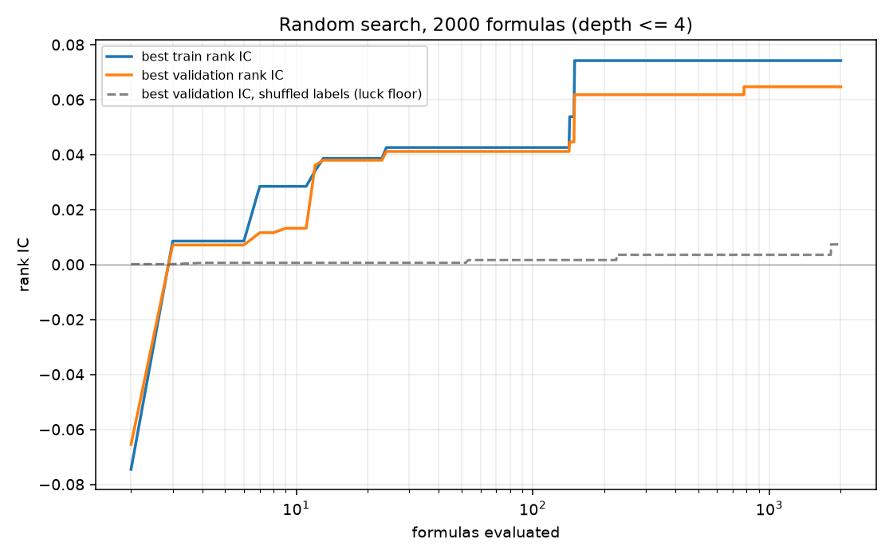
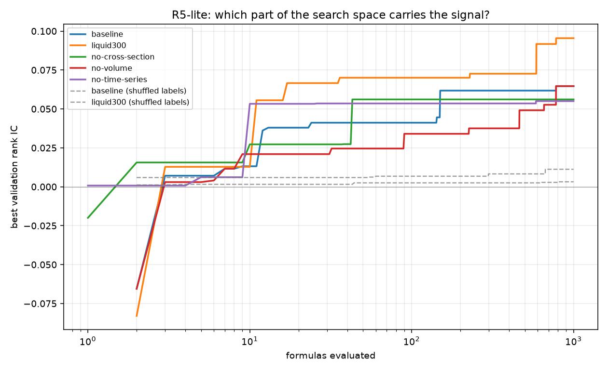

# alphamine

Studying **how alpha-mining systems search** - not producing production factors.

Every miner answers three questions: what is the *search space*, what is the
*fitness function*, and what is the *search procedure*. This repository exists to
change one of those at a time and measure the effect.

## The one rule

**Hold the evaluation budget fixed.** A method is scored by the best validation
rank IC it reaches after the same number of formulas have been *evaluated*.
Otherwise you are comparing compute, not strategy.

That rule has teeth. It is why the operator set is bounded by measured cost (see
`max_window` in `alphamine/expr/ops.py`) rather than by what sounds reasonable,
and why the run log records the evaluation index of every formula.

## Status

Working end to end: panel loading, universe rules, an expression engine with a
bounded subtree cache, IC/ICIR/turnover scoring, run logging, budget curves, and
the random-search baseline with a shuffled-label null model. 35 tests pass in
0.2 s against a synthetic panel.

Not started: genetic programming (P1), RL generation (P2), surrogates (P3), the
LLM loop (P4), and the original ideas R1-R7 except a first cut of R2.

## Quick start

```bash
conda activate alphamine

# What is in the data, and how fast is the harness?
python -m alphamine.cli check

# The random baseline: best-of-N as a function of N (experiment P0.2)
python -m alphamine.cli random --n 2000 --depth 4 --workers 5 --null

# Tests
python -m pytest -q
```

`--null` re-runs the same formulas against forward returns shuffled within each
date. Whatever a search still finds on shuffled labels is its luck floor.

```bash
# Search-space ablations: change one ingredient at a time (idea R5-lite)
python -m alphamine.cli ablate --n 1000 --depth 4 --workers 5
```

## Layout

| Path | What lives there |
| --- | --- |
| `alphamine/data.py` | Loading, universe rules, forward-return labels |
| `alphamine/expr/` | Expression trees, parser, operator registry, cached engine, random sampler |
| `alphamine/eval/` | Cross-sectional IC, ICIR, turnover, decay |
| `alphamine/runner.py` | Batch evaluation, budget curves, run artefacts |
| `alphamine/cli.py` | `check` and `random` entry points |
| `data/` | `daily_pv.h5` (398 MB, git-ignored) |
| `runs/` | One directory per run: `evals.csv`, `summary.json`, `budget_curve.png` |

## Data

`QuantaAlpha/qlib_csi300` on Hugging Face (Apache-2.0), file `daily_pv.h5`, key
`data`:

```bash
curl -L -o data/daily_pv.h5 \
  https://huggingface.co/datasets/QuantaAlpha/qlib_csi300/resolve/main/daily_pv.h5
curl -L -o data/daily_pv_debug.h5 \
  https://huggingface.co/datasets/QuantaAlpha/qlib_csi300/resolve/main/daily_pv_debug.h5
```

### What was verified, not assumed

* 14,215,449 rows, 5,982 instruments, 4,138 dates, 2008-12-29 to 2026-01-09.
* Fields are `$open $high $low $close $volume $factor`. **There is no `vwap`, no
  turnover in currency, no market cap and no industry classification.**
* `$close` is **already adjusted**. Large moves do not cluster in the June/July
  dividend season the way unadjusted A-share prices do, so returns are computed
  from `$close` directly.
* `$close / $factor` recovers the **raw quoted price** - checked against real
  Sheng Pu Development Bank closes (13.25 in 2008, 6.62 in 2023). Use it if you
  ever need tick-size or price-limit rules.
* `daily_pv_debug.h5` is 100 instruments x 487 dates. It is a hand-picked small
  panel, not a random subsample of 5,982, and makes a good test fixture.

### Universe rules

`build_panel` applies three, in order:

1. keep only individual stock codes - indices (`SH000300`, `SZ399300`), fund
   codes and, by default, Beijing listings (30% price limit, much thinner) are
   dropped;
2. keep only rows where the stock actually traded (`volume > 0`, finite close),
   which also removes suspension days;
3. drop each stock's first 60 traded days.

Rule 3 is what stops IPO first days from dominating everything: the file
contains moves like `SH688026 +108%` on its listing day, because STAR and
ChiNext have no price limit for the first days. Rule 3 is also why the
listing-age counter is computed on the **full history before** the date window
is applied - counting inside the window relabels every stock as newly listed and
silently deletes the first months of the study period.

Resulting universe on 2012-01-04..2026-01-09: 3,405 dates x 5,400 instruments,
1,239 to 5,146 names per day (mean 3,536). The minimum is July 2015, when more
than 1,400 A-share stocks were suspended at once.

### Label

`label(t) = close(t+5) / close(t+1) - 1`

The signal is formed at `t` and the trade happens at `t+1`, so the label never
uses a price that was available when the signal was computed. Each split drops
its last `horizon` rows so a label can never reach into the next split.

Splits: train 2012-2018, validation 2019-2020, test 2021 onwards. The test split
is not scored during search runs (`Config.score_test`), per the study plan's own
checklist.

### Fields available to the search

`open high low close volume returns vwap_proxy adv20`

`vwap_proxy` is `(high + low + close) / 3`. It is a stand-in, **not** the variable
the 101 Alphas were written for. 48 of the 101 Alphas need `vwap`, market cap or
industry neutralisation and cannot be reproduced from this dataset; 35 can, from
OHLCV alone.

## Reference points measured so far

Full panel, single core, float32:

| Operation | Cost |
| --- | --- |
| Read the HDF5 and widen to `date x instrument` | 3.6 s |
| One panel copy | 74 MB |
| `ts_mean(volume, 250)` | 0.15 s |
| `ts_rank(volume, 60)` | 0.97 s |
| `ts_argmax(volume, 30)` | ~1.2 s |
| `ts_argmax(volume, 250)` | 8.9 s (capped away) |
| `ts_median(volume, 20)` | 2.7 s (removed from the default pool) |
| Whole formula: evaluation 0.72 s + scoring 1.31 s | ~2.1 s |

Two operator-set decisions came out of these numbers. `ts_rank` was rewritten as
a chunked sliding-window comparison, 5x faster than `Rolling.rank` at window 20.
`ts_median` has no fast rolling implementation in pandas or numpy, so it is
registered but excluded from the default pool; an ablation (idea R5) can switch
it back on.

Scoring, not evaluation, is the bottleneck: four cross-sectional rank passes per
formula. Making Pearson IC opt-in (`--pearson`) already removed a third of it.
The next real win would be ranking once per split instead of once per
(split, metric) pair, or moving the correlation into pure numpy.

### The luck floor

200 pure random-number factors against the real panel, 2019-2020 validation:

| | train IC | validation IC |
| --- | --- | --- |
| mean | -0.0000 | +0.0000 |
| standard deviation | 0.0005 | 0.0008 |
| maximum of 200 draws | +0.0012 | +0.0022 |

Two consequences. First, the harness has no alignment or look-ahead bias a
meaningless factor can exploit - the null is centred on zero. Second, **a
validation edge smaller than about 0.002 is not distinguishable from noise on a
single seed.** Any leaderboard (idea R3) needs several seeds, and any claimed
improvement needs to be larger than that.

## The random baseline (P0.2)

2,000 distinct random formulas, depth <= 4, full panel:

| N evaluated | best train rank IC | best validation rank IC | shuffled-label validation |
| --- | --- | --- | --- |
| 100 | +0.0426 | +0.0411 | +0.0016 |
| 250 | +0.0742 | +0.0618 | +0.0035 |
| 1,000 | +0.0742 | +0.0647 | +0.0035 |
| 2,000 | +0.0742 | +0.0647 | +0.0073 |

The curve saturates by N = 100: random search gets 63% of its final answer from
the first 5% of the budget. See `docs/p02-random-baseline.md` for the write-up,
the artefact checks and the caveats that stop these numbers from being
comparable with published CSI 300 results. Reading the winning formulas suggests
reversal; measuring them says otherwise - see the R5-lite section below.



## Search-space ablations (R5-lite)

Five variants, 1,000 formulas each, same seed and depth:

| variant | operators | inputs | best train | best valid | shuffled-label valid |
| --- | --- | --- | --- | --- | --- |
| `baseline` | 37 | 8 | +0.0742 | +0.0647 | +0.0032 |
| `liquid300` | 37 | 8 | +0.0794 | +0.0955 | +0.0112 |
| `no-cross-section` | 32 | 8 | +0.0772 | +0.0561 | - |
| `no-volume` | 37 | 6 | +0.0593 | +0.0647 | - |
| `no-time-series` | 20 | 8 | +0.0844 | +0.0550 | - |



What it says:

* **The universe is the biggest single lever.** The same formulas on the 300
  most traded names score +0.0955 instead of +0.0647, so the signal is not a
  small-cap artifact. Each universe variant gets its own null, because a
  300-name cross-section has a higher selection floor (+0.0112 against +0.0032).
* **Cross-sectional normalisation is nearly worthless** - dropping all five
  `rank`/`zscore`/`scale`/`demean`/`cs_median` operators costs 13%.
* **Volume inputs are exactly worthless.** The baseline winner contains
  `ts_max(sign(volume), 60)`, which is a no-op constant: the real factor is
  `ts_min(low / vwap_proxy, 30)`, and deleting the volume term changes the IC by
  0.0001. Always simplify a mined formula before believing it.
* **The winning signal is a low-volatility characteristic, not reversal** -
  +0.0642 at a 5-day horizon rising to +0.0883 at 20 days, 3.3% daily turnover,
  and -0.76 correlation with realised volatility.

`docs/r5-lite.md` has the full analysis, including the two distinct signals the
two grammars found and the overfitting gap per variant.

## Next

1. Finish P0.2 at 10,000 evaluations and record the curve.
2. A `bottom300`-by-turnover contrast, to separate "liquid" from
   "high-attention" and to price the turnover-selection effect.
3. A market-cap or index-membership universe, so the numbers become comparable
   with published CSI 300 work.
4. P0.1: transcribe the 35 reproducible 101 Alphas and tabulate their IC, decay
   and turnover.
5. P1: minimal GP, then the parsimony and early-stopping ablation. The bar to
   beat is +0.0647 at N = 1,000 on the full universe, +0.0955 on `liquid300`.
