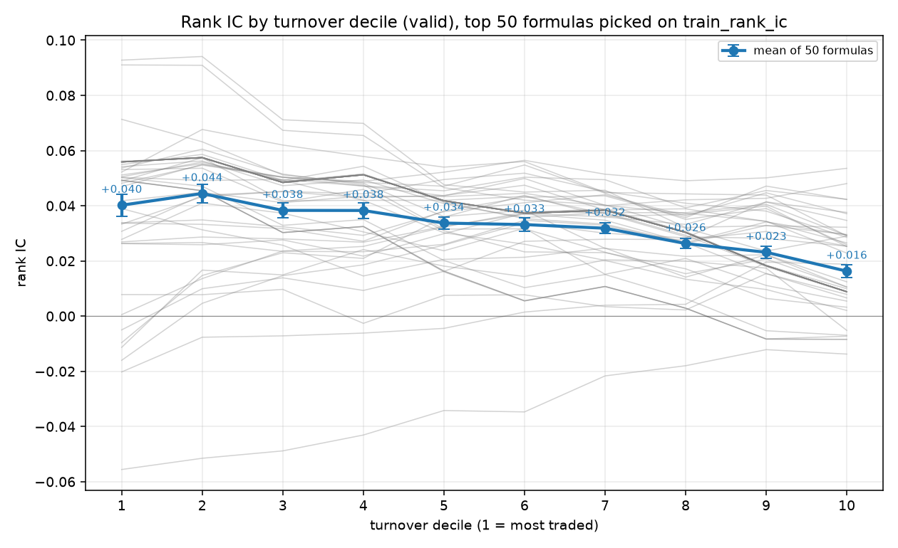

# alphamine

A test bench for **how computers search for stock-picking formulas** - not a
source of tradeable factors.

## In plain terms

Picture a beach with gold buried in it. The gold is a *formula*: something like
"the lowest price in the last 30 days, divided by today's average price". Run it
and every stock gets a number, and that number is a guess about which stocks will
do better.

There are many ways to hunt for it. Sweep with a metal detector (genetic
programming), dig at random (random search), ask a model where to dig (an LLM).
Every method claims to find the most gold - but dig longer and you find more, no
matter how clever you are, so "who found more" means nothing on its own. This
repository gives every method **the same number of shovels** and only then
compares.

**How a formula gets a score.** Rank all the stocks by the formula's number, then
compare that ranking with how those stocks actually moved. Perfect agreement is 1;
no relation at all is 0. The best formula found here so far scores +0.065 across
the whole market and +0.095 among the most traded names. That sounds tiny, and it
is: published CSI 300 results sit near 0.05, and 0 is coin-flipping. It is a
slight edge, not a prediction.

**Why there is so much machinery about "controls".** Flip 1000 coins and some
pattern will look lucky. So every search is also re-run with the actual returns
**shuffled**, which destroys any real signal - whatever it still "finds" was luck.
A search over 300 stocks has a higher luck floor than one over 5,000, so two
universes can never be compared without each one's own shuffled run. A lot of the
code exists to keep that honest.

**Three things it has shown so far**, in plain terms:

1. **Random digging saturates almost immediately.** 100 formulas already reach 63%
   of the best answer that 2,000 formulas ever get. The problem may be easier than
   the field assumes, which leaves little room for cleverer methods to earn their
   complexity.
2. **The biggest lever is which stocks you look at, not how clever the search is** -
   and it points the opposite way to the obvious guess. The most traded names work
   best, not obscure small caps. The least traded names only look good until their
   own luck floor is subtracted.
3. **The best formula is not what it appears to be.** Its volume term is a red
   herring. What it really measures is **price stability**: steadier, less volatile
   stocks tend to do better. It gets stronger over a 20-day horizon, so it is not a
   short-term bounce.

## The formal version

Every miner is three choices: a *search space*, a *fitness function* and a *search
procedure*. This repository changes one of them at a time and measures what
happens, so a claim like "genetic programming beats random search" becomes a
number with an error bar on it instead of an opinion.

**Not the goal.** Tradeable factors, matching published benchmarks, industrial
data pipelines, live trading.

## The one rule

**Hold the evaluation budget fixed.** A method is scored by the best validation
rank IC it reaches after the same number of formulas have been *evaluated*.
Otherwise you are comparing compute, not strategy.

That rule has teeth, and most of the design follows from it:

* the operator set is bounded by measured wall-clock cost (`max_window` in
  `alphamine/expr/ops.py`) rather than by what sounds reasonable - at the same
  window the slowest operator is ~60x the fastest, which would make a formula
  budget meaningless;
* a formula's identity is its **canonical string**, with commutative operators
  sorted, so `a+b` and `b+a` are one candidate and one cache entry - the budget
  counts distinct ideas rather than duplicates;
* an unbounded result cache is unusable, because one panel is ~74 MB and a run
  evaluates thousands of them, so the cache is bounded by **bytes**, not entries;
* every run records the evaluation index of every formula, so best-of-N can be
  read at any N rather than only at the end.

## What it does today

Working end to end:

* **Data** - load `daily_pv.h5`, coerce it to a `date x instrument` float32
  panel, apply the universe rules, build forward-return labels.
* **Universes** - the whole market, trailing-turnover slices (`top`/`bottom`), or
  true point-in-time index membership (`csi300`, from a free MIT dataset).
* **Expressions** - 38 operators in three families (`arith`, `ts`, `cs`); a
  parser that accepts both `ts_mean(volume, 20)` and infix `a / b`; `to_rpn` for
  a future RL generator.
* **Evaluation** - an engine with a byte-budgeted LRU subtree cache, plus a
  type-aware random sampler.
* **Scoring** - cross-sectional rank IC, Pearson IC (opt-in), ICIR, turnover and
  decay.
* **Search** - batch evaluation across worker processes and best-of-N budget
  curves.
* **Nulls** - shuffled-label and random-number models, computed per universe.
* **Experiments** - the `check`, `random` (P0.2), `ablate` (R5-lite) and
  `profile` entry points.

Not started: genetic programming (P1), RL generation (P2), surrogate models
(P3), the LLM loop (P4), and ideas R1, R3, R4, R6 and R7. R2 has a first cut in
the form of the shuffled-label nulls; R5-lite is done.

**Tests:** 54 tests in ~0.3 s. They run against a **synthetic in-memory panel**
and need no data download.

## Where things are

| | |
| --- | --- |
| Repository | https://github.com/Timothy-yqw19/alphamine (public, MIT) |
| Conda env | `alphamine`, Python 3.11.17 |
| Panel | `data/daily_pv.h5`, 398 MB, git-ignored |
| Run artefacts | `runs/<timestamp>-<name>/`, git-ignored |
| Picking the work up | `docs/HANDOFF.md` |

These are the versions every number below was measured with. `pyproject.toml`
deliberately only sets lower bounds:

| | | | |
| --- | --- | --- | --- |
| numpy 2.4.6 | pandas 3.0.6 | scipy 1.17.1 | tables 3.11.1 |
| h5py 3.16.0 | matplotlib 3.11.2 | pytest 9.1.1 | |

**pandas 3.0** is the version that changes behaviour rather than just numbers:
copy-on-write is always on, and `pct_change` no longer pads by default. The code
is written against that.

## Quick start

```bash
conda activate alphamine

# 398 MB, not in the repo
curl -L -o data/daily_pv.h5 \
  https://huggingface.co/datasets/QuantaAlpha/qlib_csi300/resolve/main/daily_pv.h5

# Point-in-time CSI 300 / CSI 500 membership - 93 KB, see "Index membership"
mkdir -p data/index_membership
for i in csi300 csi500; do
  curl -L -o "data/index_membership/$i.csv" \
    "https://raw.githubusercontent.com/unliftedq/index-constitution/main/history/$i.csv"
done

# What is in the data, and how fast is the harness?
python -m alphamine.cli check

# 54 tests, ~0.3 s - synthetic panel, no download needed
python -m pytest -q
```

`daily_pv_debug.h5` is a separate 1.4 MB fixture (100 instruments x 487 dates).
Neither the tests nor the CLI need it - the tests build their own panel and
`config.DEBUG_DATA_PATH` is currently unused - so download it only if you want a
small *real* file to experiment against.

Then a real experiment:

```bash
# The random baseline: best-of-N as a function of N (P0.2). ~50 min with --null.
python -m alphamine.cli random --n 2000 --depth 4 --workers 5 --null

# Search-space ablations: change one ingredient at a time (R5-lite). ~90 min.
python -m alphamine.cli ablate --n 1000 --depth 4 --workers 5

# Just the universe whose ICs are comparable with published CSI 300 work.
python -m alphamine.cli ablate --n 1000 --depth 4 --workers 5 \
  --variants csi300 --null-variants csi300 --name r5-lite-csi300

# Where in the liquidity spectrum a fixed set of formulas lives (~2 min).
python -m alphamine.cli profile --run runs/<p02-run-dir> --top 50 --buckets 10
```

Useful flags: `--null` re-runs the same formulas against forward returns shuffled
within each date (whatever a search still finds on shuffled labels is its luck
floor); `--pearson` adds Pearson IC, which costs about a third of the runtime
because it is a second full correlation pass; `--score-test` scores the held-out
split and is reserved for the very end of the study.

Runs are seeded and the proposal order is recorded, so they are deterministic.
Each run writes `evals.csv` (one row per formula, in evaluation order),
`summary.json` and a chart into `runs/<timestamp>-<name>/`.

## How a run works

1. `load_panel` reads the HDF5, widens it to one float32 `date x instrument`
   frame per field, applies the three universe rules, and returns a `Panel` with
   a `tradable` mask. Reading and widening costs 3.6 s.
2. `sample_random_formulas` draws type-correct trees to the requested depth and
   canonicalises each one; duplicates of an already-seen canonical string are
   never counted twice.
3. `evaluate_batch` hands the batch to worker processes. Each worker loads its
   own copy of the panel (~74 MB) and one engine with a byte-budgeted LRU cache.
4. The engine evaluates a tree bottom-up, caching every subtree by its canonical
   string, so shared subtrees across formulas are computed once.
5. Each factor frame is scored per split: a cross-sectional rank IC per date,
   aggregated into mean IC, ICIR, coverage and turnover.
6. `budget_curve` replays `evals.csv` in evaluation order and records the running
   best on train and validation - that curve *is* the fixed-budget result.

## Layout

| Path | What lives there |
| --- | --- |
| `alphamine/data.py` | Loading, universe rules, forward-return labels |
| `alphamine/expr/` | Expression trees, parser, operator registry, cached engine, random sampler |
| `alphamine/eval/` | Cross-sectional IC, ICIR, turnover, decay |
| `alphamine/runner.py` | Batch evaluation, budget curves, run artefacts |
| `alphamine/ablation.py` | R5-lite variants and the turnover decile profile |
| `alphamine/cli.py` | `check`, `random`, `ablate` and `profile` entry points |
| `docs/HANDOFF.md` | Start here to continue the work in a fresh session |
| `docs/p02-random-baseline.md` | The P0.2 write-up, with caveats |
| `docs/r5-lite.md` | The ablation and turnover-profile analysis |
| `docs/runs/` | Every run's `summary.json` **and** per-formula `evals.csv` - the evidence chain for the numbers below |
| `scripts/` | Standalone checkers, e.g. which of the 101 Alphas this dataset can express |
| `data/` | `daily_pv.h5` (398 MB, git-ignored) |
| `runs/` | One directory per run, including the per-formula `evals.csv` (git-ignored) |

## Data

`QuantaAlpha/qlib_csi300` on Hugging Face (Apache-2.0), file `daily_pv.h5`, key
`data`:

```bash
curl -L -o data/daily_pv.h5 \
  https://huggingface.co/datasets/QuantaAlpha/qlib_csi300/resolve/main/daily_pv.h5
```

### Index membership (point-in-time)

The panel has no market cap and no index membership, so `liquid300` and
`illiquid300` are a trailing-**turnover** proxy for the liquid segment - useful,
but not the index. ICs that are meant to be comparable with published CSI 300
results need the actual index, and its history is free:

```bash
mkdir -p data/index_membership
for i in csi300 csi500; do
  curl -L -o "data/index_membership/$i.csv" \
    "https://raw.githubusercontent.com/unliftedq/index-constitution/main/history/$i.csv"
done
```

[index-constitution](https://github.com/unliftedq/index-constitution) (MIT)
reconstructs the semi-annual CSI announcements into explicit `opt-in`/`opt-out`
intervals - real point-in-time membership, not a current snapshot. Verified here:
`csi300.csv` holds 1,225 membership rows over 949 symbols from 2005-04-08 to
2026-06-12, and 936 of those symbols (98.6%) are present in this panel; on
2015-06-30, 2020-06-30 and 2025-06-30 the file marks exactly 300 members, all 300
of them in the panel. The 13 absent symbols are long-delisted tickers.

Enable it with `--variants csi300`, or `Config(universe_slice=("index", "csi300"))`.
As with the turnover slices, the restriction is applied to the **panel**, not just
to a scoring mask, so cross-sectional operators rank inside the index.

```bash
python -m alphamine.cli ablate --n 1000 --depth 4 --workers 5 \
  --variants csi300 --null-variants csi300 --name r5-lite-csi300
```

### What was verified, not assumed

* 14,215,449 rows, 5,982 instruments, 4,138 dates, 2008-12-29 to 2026-01-09.
  (`index.levels[1].nunique()` reports 6,016 for the same file - MultiIndex
  levels are padded. Use `levels[i].unique()` or the actual values. On the
  100-instrument debug file the padded count is 3,784, badly over-reporting by a
  factor of 38.)
* Fields are `$open $high $low $close $volume $factor`. **There is no `vwap`, no
  turnover in currency, no market cap and no industry classification.**
* `$close` is **already adjusted**. Large moves do not cluster in the June/July
  dividend season the way unadjusted A-share prices do, so returns are computed
  from `$close` directly.
* `$close / $factor` recovers the **raw quoted price** - checked against known
  closes: Kweichow Moutai 1691.00 on 2023-06-30, Ping An 46.40, SMIC 50.52, SPD
  Bank 13.25 in 2008 and 6.62 in 2023. Use it if you ever need tick-size or
  price-limit rules.
* Suspended stocks are **absent rows**, not `volume == 0` rows. On 2015-07-09 the
  raw file has 2,790 instruments but only 1,347 traded, which is how the July
  2015 suspension wave shows up.
* `daily_pv_debug.h5` is 100 instruments x 487 dates. It is a hand-picked small
  panel, not a random subsample of 5,982.

### Universe rules

`build_panel` applies three, in order:

1. keep only individual stock codes - indices (`SH000300`, `SZ399300`), fund
   codes and, by default, Beijing listings (30% price limit, much thinner) are
   dropped;
2. keep only rows where the stock actually traded (`volume > 0`, finite close),
   which also removes suspension days;
3. drop each stock's first 60 traded days.

Rule 3 is what stops IPO first days from dominating everything: the file
contains moves like `SH688026 +108%` on its listing day, because STAR and
ChiNext have no price limit for the first days. Rule 3 is also why the
listing-age counter is computed on the **full history before** the date window
is applied - counting inside the window relabels every stock as newly listed and
silently deletes the first months of the study period.

Resulting universe on 2012-01-04..2026-01-09: 3,405 dates x 5,400 instruments,
1,239 to 5,146 names per day (mean 3,536). The minimum is July 2015, when more
than 1,400 A-share stocks were suspended at once - a useful check that the
tradability filter is doing its job.

Two optional restrictions sit on top of this, both selected by
`Config.universe_slice` and both applied to the **panel** rather than to a scoring
mask, so cross-sectional operators rank inside the restricted universe: the
trailing-turnover slices (`liquid300` / `illiquid300`) and true point-in-time
index membership (`csi300`, see *Index membership* above).

### Label and splits

`label(t) = close(t+5) / close(t+1) - 1`

The signal is formed at `t` and the trade happens at `t+1`, so the label never
uses a price that was available when the signal was computed. Each split drops
its last `horizon` rows so a label can never reach into the next split. Note that
horizon 1 is degenerate under this convention - `close(t+1)/close(t+1) - 1` is
identically zero - which is why `decay_curve` starts at 2.

Splits: train 2012-2018, validation 2019-2020, test 2021 onwards. Search runs
score train and validation only (`Config.score_test`, exposed as
`--score-test`).

**One correction to be precise about.** That guard was added later. An early
harness smoke run (`runs/20261001-215104-smoke`, 60 random formulas) predates it
and did compute test ICs. Nothing was ever selected on them, that run is not
cited in any document, and every subsequent run leaves the test column at zero -
so the test period is still unspent for practical purposes. But "the test split
has never been computed" would be false, and it should not be repeated.

### Fields available to the search

`open high low close volume returns vwap_proxy adv20`

`vwap_proxy` is `(high + low + close) / 3`. It is a stand-in, **not** the variable
the 101 Alphas were written for. Of the 101, **35 can be reproduced from OHLCV
alone**; 47 need `vwap` (34) or an industry classification (13), and 19 are not
implemented in the reference source at all. That split is reproducible rather than
estimated - statically parsing the two implementations in
[yli188/WorldQuant_alpha101_code](https://github.com/yli188/WorldQuant_alpha101_code)
gives 35 / 34 / 13 / 19 = 101, and the same 35 alphas are OHLCV-only in both
files. Re-run `python scripts/count_101_alphas.py` to check that, and to print
the 35 ids - which are the P0.1 worklist.

## Reference points measured so far

Full panel, single core, float32:

| Operation | Cost |
| --- | --- |
| Read the HDF5 and widen to `date x instrument` | 3.6 s |
| One panel copy | 74 MB |
| `ts_mean(volume, 250)` | 0.15 s |
| `ts_rank(volume, 60)` | 0.97 s |
| `ts_argmax(volume, 30)` | ~1.2 s |
| `ts_argmax(volume, 250)` | 8.9 s (capped away) |
| `ts_median(volume, 20)` | 2.7 s (removed from the default pool) |
| Whole formula: evaluation 0.72 s + scoring 1.31 s | ~2.1 s |
| 2,000 formulas, 5 worker processes | ~18 min |

Three operator-set decisions came out of these numbers. `ts_argmax` at window 250
costs 60x `ts_mean` at the same window, so per-operator window caps keep a
formula budget meaningful. `ts_rank` was rewritten as a chunked sliding-window
comparison, 5x faster than `Rolling.rank` at window 20. `ts_median` has no fast
rolling implementation in pandas or numpy (~3 s at every window), so it is
registered but excluded from the default pool; an ablation (idea R5) can switch
it back on.

Scoring, not evaluation, is the bottleneck: four cross-sectional rank passes per
formula, about two thirds of the runtime. Making Pearson IC opt-in (`--pearson`)
already removed a third of it. The next real win would be ranking once per split
instead of once per (split, metric) pair, or moving the correlation into pure
numpy. Nothing in the results below depends on this.

### The luck floor

200 pure random-number factors against the real panel, 2019-2020 validation:

| | train IC | validation IC |
| --- | --- | --- |
| mean | -0.0000 | +0.0000 |
| standard deviation | 0.0005 | 0.0008 |
| maximum of 200 draws | +0.0012 | +0.0022 |

Two consequences. First, the harness has no alignment or look-ahead bias a
meaningless factor can exploit - the null is centred on zero. Second, **a
validation edge smaller than about 0.002 is not distinguishable from noise on a
single seed.** Any leaderboard (idea R3) needs several seeds, and any claimed
improvement needs to be larger than that.

A third rule falls out of the ablation below: **a 300-name cross-section has a
higher selection floor than the full market** (+0.0112 against +0.0032 on
shuffled labels), and the illiquid universe's floor is higher still (+0.0354).
ICs must therefore never be compared across universes without each universe's
own null.

## The random baseline (P0.2)

2,000 distinct random formulas, depth <= 4, full panel, five workers. Run
`runs/20261001-224125-p02-random-depth4`:

| N evaluated | best train rank IC | best validation rank IC | shuffled-label validation |
| --- | --- | --- | --- |
| 100 | +0.0426 | +0.0411 | +0.0016 |
| 250 | +0.0742 | +0.0618 | +0.0035 |
| 1,000 | +0.0742 | +0.0647 | +0.0035 |
| 2,000 | +0.0742 | +0.0647 | +0.0073 |

The curve saturates by N = 100: random search gets 63% of its final answer from
the first 5% of the budget. Compare methods at N = 100..1,000, not only at a
large N. Across all 1,852 non-degenerate formulas the median validation rank IC
is -0.0051 (10th percentile -0.0396, 90th +0.0184), and 7.4% of sampled trees
were degenerate.

See `docs/p02-random-baseline.md` for the write-up, the artefact checks and the
caveats that stop these numbers from being comparable with published CSI 300
results. Reading the winning formulas suggests reversal; measuring them says
otherwise - see below.


## Search-space ablations (R5-lite)

Seven variants, 1,000 formulas each, same seed and depth. Runs
`runs/20261001-225430-r5-lite`, `runs/20261002-202029-r5-lite-turnover` and
`runs/20261002-211321-r5-lite-csi300`. The `baseline`, `liquid300` and `csi300`
rows score the *same* 1,000 formulas - verified identical in order - so they
differ only in the universe:

| variant | operators | inputs | best train | best valid | shuffled-label valid |
| --- | --- | --- | --- | --- | --- |
| `baseline` | 37 | 8 | +0.0742 | +0.0647 | +0.0032 |
| `liquid300` | 37 | 8 | +0.0794 | +0.0955 | +0.0112 |
| `illiquid300` | 37 | 8 | +0.0605 | +0.0757 | +0.0354 |
| `csi300` | 37 | 8 | +0.0460 | +0.0620 | +0.0093 |
| `no-cross-section` | 32 | 8 | +0.0772 | +0.0561 | - |
| `no-volume` | 37 | 6 | +0.0593 | +0.0647 | - |
| `no-time-series` | 20 | 8 | +0.0844 | +0.0550 | - |


What it says:

* **True CSI 300 membership does not reproduce the turnover proxy's edge.**
  `csi300` scores **+0.0620** on the same 1,000 formulas - below `liquid300`'s
  +0.0955, and level with the whole market's +0.0647 (a gap of 0.0027, at the
  noise floor). So "the liquid segment is two to three times better" is a
  property of *ranking by turnover*, not of index membership: turnover bundles
  attention, holding period and volatility, none of which the index selects for.
  This is the row to quote against published CSI 300 work (QuantaAlpha report
  0.0472), and its winner is `ts_zscore(ts_min(log(close), 250), 3)`.
* **Among turnover-ranked universes, the biggest single lever moves the opposite
  way to the obvious guess.** The same formulas on the 300 most traded names score
  +0.0955 instead of +0.0647, so the signal is not a small-cap illiquidity
  artifact. The 300 *least* traded names score +0.0757 - but their
  shuffled-label floor is +0.0354, three times the liquid universe's +0.0112, so
  net of its own noise the illiquid end is the worst of the three. Raw IC ranks
  the universes backwards.
* **The illiquid winner does not survive leaving its universe.**
  `ts_skew(max2(sign(low), ts_argmin(low, 15)), 20)` is finite on only 49% of the
  illiquid cross-section, is `NaN` on `liquid300`, and scores **-0.0171** on the
  full panel.
* **The signal weakens as turnover falls.** The 50 formulas with the best
  training IC, scored inside each turnover decile on validation with no
  per-bucket search: +0.040 in the most traded decile down to +0.016 in the
  least. The single best formula runs +0.0955 / +0.0647 / +0.0298 across
  liquid / all / illiquid, at ~97% coverage in all three.
* **Cross-sectional normalisation is nearly worthless** - dropping all five
  `rank`/`zscore`/`scale`/`demean`/`cs_median` operators costs 13%.
* **Volume inputs are nearly worthless, but the volume term is not a no-op.** It
  is value-neutral, not inert: `sign(volume)` is 1 wherever volume is finite and
  `NaN` where it is not, so `ts_max(sign(volume), 60)` is a 60-day "has volume
  been observed" gate. Dropping it changes the validation rank IC by **0.00004**
  and lifts coverage from 0.975 to 0.986. The factor is otherwise
  `ts_min(low / vwap_proxy, 30)`. Always simplify a mined formula before
  believing it - but check what the part you deleted was actually doing.
* **Simpler grammars overfit more.** The train-minus-validation gap is +0.0095
  for `baseline`, +0.0211 for `no-cross-section` and +0.0294 for
  `no-time-series`.

### The winning signal, characterised rather than read

The `baseline` winner is
`mul(ts_max(sign(volume), 60), ts_min(div(low, vwap_proxy), 30))`, whose real
content is `ts_min(low / ((high + low + close) / 3), 30)`:

| property | value | convention |
| --- | --- | --- |
| validation rank IC, 5-day horizon | +0.0646 | `score_factor`, split tail dropped |
| validation rank IC, 20-day horizon | +0.0890 | `score_factor`, split tail dropped |
| one-day turnover of the rank-weighted book | 0.033 | `metrics.turnover` |
| correlation with 20-day realised volatility | -0.763 | mean daily cross-sectional Spearman |
| correlation with the trailing 3-day return | -0.004 | mean daily cross-sectional Spearman |
| rank IC on `liquid300` / all / `illiquid300` | +0.0955 / +0.0647 / +0.0298 | full stored winner, not simplified |

The horizon-20 figure is the important one: the signal gets **stronger** at
longer horizons, so it is not reversal. Read the convention column - this table
used to mix two of them. An earlier `metrics.decay_curve` filtered its window by
date alone and did not drop the last `horizon` rows, so it reported +0.0642 /
+0.0883 for the same factor; it has since been fixed and now agrees with
`score_factor`. The bottom row is the full stored winner, because the volume gate
changes coverage and therefore the per-universe name counts.

It is a **low-volatility, price-stability characteristic**, orthogonal to
reversal, with low turnover. An earlier draft of `docs/p02-random-baseline.md` guessed "short-horizon reversal" from
reading the formula; the decay and turnover measurements say otherwise, and the
correction is recorded in both documents rather than edited away.

### Turnover decile profile

Ten formulas are not enough and searching per bucket would be worse. The profile
takes the 50 formulas with the best **training** IC from the P0.2 run and scores
each one inside every turnover decile on **validation**. No search happens per
bucket, so no bucket's IC is a selected maximum. Run
`runs/20261001-224125-p02-random-depth4/turnover-profile-valid.csv`:

| decile (1 = most traded) | 1 | 2 | 3 | 4 | 5 | 6 | 7 | 8 | 9 | 10 |
| --- | --- | --- | --- | --- | --- | --- | --- | --- | --- | --- |
| mean rank IC | +0.040 | +0.044 | +0.038 | +0.038 | +0.034 | +0.033 | +0.032 | +0.026 | +0.023 | +0.016 |
| standard error | 0.004 | 0.003 | 0.003 | 0.003 | 0.002 | 0.002 | 0.002 | 0.002 | 0.002 | 0.002 |

Monotone from decile 2 down, ends differ by +0.024 against a combined standard
error of 0.005.



`docs/r5-lite.md` has the full analysis: the turnover contrast, the
fixed-formula decile profile, the two distinct signals the two grammars found,
and the overfitting gap per variant.

## Traps

* **Stage explicit paths; never `git add -A` in a working copy like this one.**
  It has already swept unrelated files into a commit once.
* **Worker processes use `spawn`** and each one loads its own panel, so budget
  ~15 s of startup per worker per batch. Five workers cost about 7 GB resident;
  do not raise the count without checking memory.
* **Matplotlib needs `MPLCONFIGDIR`** pointed at a writable directory
  (`MPLCONFIGDIR=/tmp/mplcache`) if the home directory is not writable.
* **`runs/` and `data/` are git-ignored**, so a fresh clone can reproduce the code
  but not the runs. Each run's `summary.json` and its per-formula `evals.csv` are
  therefore copied into `docs/runs/` as the evidence chain, and documentation
  charts into `docs/images/`. Both need a `.gitignore` exception: `runs/` matches
  at any depth (so `docs/runs/` had to be re-included explicitly) and `*.png` is
  ignored globally.
* **A formula that is only good inside the universe where it was found is not a
  factor.** Check every winner on at least one other universe before reporting
  it, and against that universe's own null.
* **`metrics.decay_curve` used to leak across the split boundary.** It filtered
  its window by `start`/`end` alone instead of dropping the last `horizon` rows,
  so at horizon 20 with the default `end="2020-12-31"` its labels reached into
  January 2021 - inside the test period. Fixed, and pinned by
  `test_decay_curve_agrees_with_the_split_clean_scorer`. Anywhere this repo still
  quotes +0.0642 / +0.0883 for the P0.2 winner, that is a pre-fix number.
* `docs/HANDOFF.md` section 7 lists ten real bugs that produced silently wrong
  numbers, with regression tests for most of them. Two are worth knowing before
  writing any pandas here: `df / series` and `df.gt(series)` align a per-date
  Series against the *columns*, so they need `axis=0`; and a listing-age counter
  computed inside the date window relabels every stock as newly listed.

## Next

1. **P0.1** - transcribe the 35 reproducible 101 Alphas and tabulate IC, decay
   and turnover. This is the only thing that anchors the project to the
   published literature, and it is mostly transcription rather than engineering.
2. **A market-cap universe.** The index-membership half is done - `csi300`
   gives point-in-time CSI 300 membership, and the result is that the index does
   *not* inherit `liquid300`'s edge (+0.0620 against +0.0955). Market
   capitalisation itself is still missing, and would let the free-float ranking
   CSI actually uses be reproduced.
3. **P1** - minimal genetic programming (~200 lines), then the parsimony and
   early-stopping ablation. The bar to beat is +0.0647 at N = 1,000 on the full
   universe and +0.0955 on `liquid300`.
4. **R2 properly** - shuffled-label runs at large N, to separate "the grammar is
   a strong prior" from "the search procedure is smart".
5. **R3** - the equal-budget leaderboard across random / GP / RL / surrogate /
   LLM at 2,000 evaluations and five seeds. Budget roughly 8 hours at five
   workers for 60,000 evaluations.
6. Finish **P0.2 at 10,000 evaluations** as originally specified.
7. R1 (planted-alpha synthetic market), R4 (MAP-Elites), R6 (decay and
   transfer), R7 (multiple-testing correction). For R7, `factor-qc` and
   `Perception-XAlpha Lite` already implement DSR / PBO / White's Reality Check,
   so do not hand-roll them.

## Licence

MIT - see [LICENSE](LICENSE).
